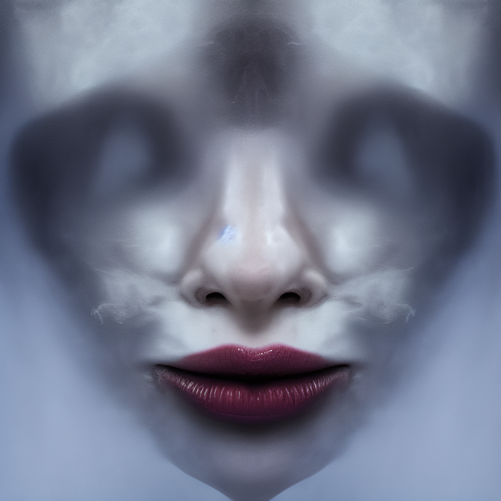

“Schaust du des nachts in den Spiegel, leitet es dich zur Wahrheit.” 
“Das Flüstern während des nächtlichen Spiegelblicks, führt dich ins Verderben.” 
“Folge dem Flüstern in die gespiegelte Welt.” 

Wer des nachts in einer per Hand gefertigten, spiegelnden Fläche schaut, hat eine Chance auf den Specularen, den Spiegelflüsterer, die gespiegelte Stimme zu treffen. Es ist ein Wesen, das von sich selbst behauptet nahezu allmächtig zu sein. Es existiert soweit bekannt nur innerhalb von Spiegeln oder spiegelnden Oberflächen, die durch Handwerk gefertigt wurden wie zum Beispiel spiegelnde Schwertklingen, glatt geschliffener Stein, etc. Aber ob es sich dabei um eine andere Welt handelt, ob er wirklich in den Oberflächen lebt und ob jeder “Spiegel” eine eigene Welt ist, weiß niemand. 
Der Specular ist ein egozentrisches Wesen, das nur seine eigene Agenda im Sinn hat. Aber nur es selbst weiß, was seine Ziele sind. Die Unterweltler haben erst in den letzten Jahren großflächig von der Existenz erfahren, meist in der Form von lokalen Sprichwörtern, Warnungen oder [Kindergeschichten](../../../../Kindergeschichten.md), die dazu ermahnen des Nachts zu lange in Spiegel zu schauen und schon gar nicht mit einer offenen Flamme/Lichtquelle in einen Spiegel hineinzuleuchten. Angeblich fühlt sich der Specular angezogen von dem Licht und bisherige Berichte sagen, dass er nur des Nachts wirklich in Erscheinung tritt. 

Findet er einen Gesprächspartner, wird sein seltsames Gesicht, das keinem Mann, keiner Frau und keiner Rasse zugeordnet werden kann, auf der Oberfläche sichtbar. Stets mit einem breiten Lächeln beginnt er das Gespräch und für denjenigen, der seine Aufmerksamkeit erregt hat und ihm im Spiegel erblickt, sieht es so aus, als würde Nebel aus seinem Mund und Augen dringen, der die Welt in einen silbrigen Dunst taucht. Es gibt auch Berichte, dass mehrere Personen in diese Spiegelwelt gezogen werden. 
Der Spiegel selbst bleibt aber nur ein Fenster zur Welt des Wesens und keine Tür. Erst nach einer Unterhaltung werden die Gefangenen der Spiegelwelt wieder freigelassen. In der realen Welt vergehen nur Augenblicke in denen die Gefangenen abwesend in den Spiegel starren. Alle anderen können sonst keine Anzeichen des Specular erkennen. Für Außenstehende ist der Spiegel unverändert. 

Die Unterhaltung führt der Specular auf eine Art und Weise, wie es seinem Ziel dienlich ist. Die Geschichten behaupten, dass er immer genau das sagt, was er sagen muss, um sein Ziel zu erreichen und niemals versagt, weil er alle denkbaren Zukünfte kennt und seine Worte deshalb so wählt, dass seine Gesprächspartner genau so handeln, wie es es will. Manche Geschichten behaupten sogar, dass nach einem Gespräch mit dem Spiegel niemand mehr über einen freien Willen verfügt. Unter den Göttern gibt es die Befürchtung, dass der Specular irgendwie für den Niedergang verantwortlich sein könnte, indem er diversen Göttern Dinge zugeflüstert hat, die dazu geführt haben, dass die Welt auf ewig verändert wurde. Den Spekulationen dieser [Götter](../../../../G%C3%B6tter.md) nach alles mit dem Ziel, das der Specular aus seiner Spiegelwelt entkommen und in Adora übertreten kann. Aber da der Spiegel immer nur ein Fester ist, kann niemand, selbst der mächtigste Gott, den Specular zu einer wahren Aussage zwingen und wenn sie es versuchen, laufen sie Gefahr Teil des Plans des Specular zu werden. 

Manchmal führt das Geflüster des Specular die Lauscher in den Untergang, meist führt es zu keinen sichtbaren Konsequenzen und manchmal bringt es ihnen unglaubliches Glück. Daher existieren auch die unterschiedlichsten Ansichten, Meinungen und Geschichten zum Specular. Es haben sich Kulte um ihn entwickelt und manche [Götter](../../../../G%C3%B6tter.md) hetzen gegen ihn auf und verbieten spiegelnde Oberflächen überall in ihrem Reich.