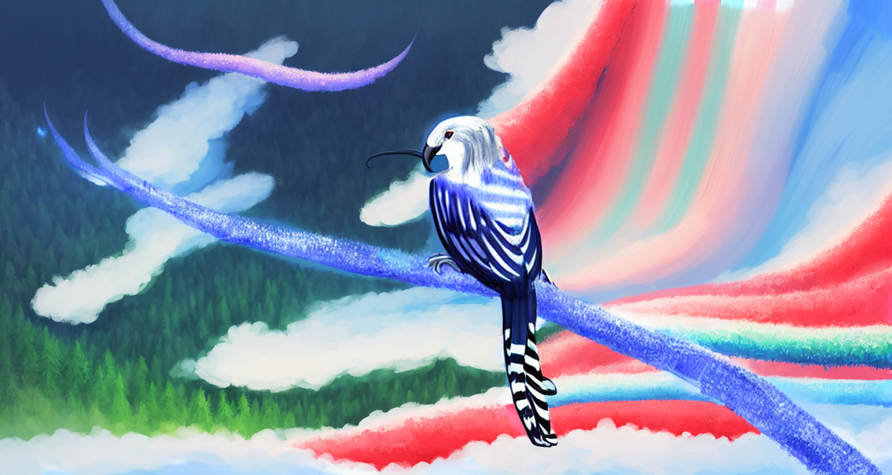

Ein Vogel, der seit dem [Niedergang](../../Geschichte%20von%20Adora/Der%20Niedergang.md) existiert und durch eine Mutation hervorgegangen ist. Er kann den Nektar der [Silberblumen](../../../../Silberblumen.md) konsumieren und ernährt sich hauptsächlich dadurch. 

Relativ kleiner Vogel, schneller Flügelschlag, kurzer Schnabel aber mit langer Zunge. Farbenprächtiges Gefieder mit beeindruckenden Streifen aus Silber. Langer Schweif. 

Schnabel ist zwar kurz aber hart genug um Silber zu zermahlen. Sie können kurzzeitig genügend Kraft entwickeln, um gehärtetes Silber zu zerbrechen und zu konsumieren. 

Begehrte Haustiere für Reiche. Zähmbar. Werden aufgrund ihrer Hauptnahrungsquelle und ihrer darauf optimierten Sinne oft als Schatzsucher für Silberquellen genutzt. 