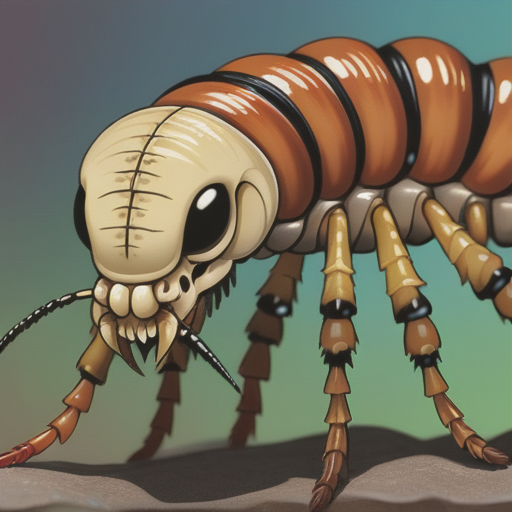

```table-of-contents
```

## Kurzbeschreibung:
 Diese kleinen, insektenartigen Wesen leben in großen, unterirdischen Kolonien. Die größten Exemplare werden etwa so groß wie Dackel. Sie sind schnell und wendig, aber einzeln gesehen nicht sehr stark. Ihre Stärke liegt in ihrer Zahl und ihrer Fähigkeit, blitzschnell aus dem Boden zu erscheinen und wieder zu verschwinden. Sie ernähren sich von organischen Abfällen, können aber in großen Schwärmen auch Felder verwüsten.
 
 Ihre Tunnelsysteme sind weitreichend und es ist nicht ungehört, dass kleine Landstriche nach einem starken Regenfall absacken, weil die Skritterlinge das Land untergraben haben und ihre Tunnel der Last nicht standhalten konnten. 

### Brainstorming:


### Inspiration:
- Termiten und Ameisen
- Falltürspinnen
- Antlion Larve

### Thema
Sie sind eine Plage für Bauern und verhindern die Ausbreitung von Siedlungen ohne eine direkte Gefahr für die Unterweltler darzustellen. 

Sie ewrden nur dann aggressiv, wenn ihre Königin/Kollonie in Gefahr ist. 

Jene, die ihr Gebiet erkunden, müssen aufpassen von ihnen nicht in die Füße/Waden gebissen zu werden, was schmerzhaft aber nicht unbedingt lebensbedrohlich ist. 


## Grundlagen: 
**Name**: Skritterling (Skritterlinge)
**Wissenschaftlicher Name**:
**Andere häufig verwendete Namen**: Gräber

**Zusammenfassung**
Die Skritterlinge sind Bewohner von leicht bewaldeten Gebieten. Sie präferieren tropisches und gemäßigtes Klima. Sie meiden dichte Wälder, da zu viele Wurzeln ihre Koloniebildung erschweren. 

Da sie schnell, wendig und Tunnelbewohner sind, sind sie sehr schwer zu fangen, geschweige denn zu bekämpfen. Ihre Königin befindet sich nahezu durchgehend im Untergrund und wird von dem Rest der Kolonie geschützt. 

Sie ernähren sich von allen Arten biologischer Reste. Es gibt zwei Arten von Skritterlingen - Sammler und Jäger. Die Sammler sind kleiner und flinker und haben einen flachen Rücken, der einen natürlichen Klebstoff ausbildet und ihnen hilft möglichst viele Pflanzenreste oder Aaß zurück zur Kolonie zu transportieren. Die Jäger sind größer und haben eine flache Schnauze in Erdfarben. Sie graben Löcher, legen sich Schnauze nach oben hineinen und bedecken sich dann mit einer dünnen Schicht Erde. Sobald eine geeignete Beute sich über diese Falle bewegt, schnappen sie zu. 

Ihre typische Beute besteht aus sich schnell vermehrenden, kleinen Tieren (Hasen, Mäuse, etc.), aber auch aus schwachen Jungtieren größerer Tiere (z.b. Rehe, Ziegen).


| Eigenschaft                                            | Beschreibung                                                                                                                                                          |
| ------------------------------------------------------ | --------------------------------------------------------------------------------------------------------------------------------------------------------------------- |
| Heimatland                                             | leicht bewaldete tropische und gemäßigte Landstriche                                                                                                                  |
| Hierarchie                                             | Königin → Königliche Wache → Arbeiter → Jäger und Sammler                                                                                                             |
| Politische System                                      | Nope                                                                                                                                                                  |
| Religiöse System                                       | Nope                                                                                                                                                                  |
| Soziale System                                         | Ausgeprägtes soziales Verhalten. Die Skitterlinge schützen einander und alle schützen die Königin. Es gibt große Kriege mit anderen Kollonien um Ressourcen und Land. |
| Fortbewegungsfähigkeit                                 | Schnell und wendig. Graben und über Land.                                                                                                                             |
| Ernährung                                              | Omnivore                                                                                                                                                              |
| Art der Lebensform (Snythetisch, oraganisch, magisch?) | Organisch, existierten vor dem [Fall](../../Geschichte%20von%20Adora/Der%20Niedergang.md)                                                                                                               |
| Spezielle Fähigkeiten                                  | Bauen Fallen, produzieren natürlichen Klebstoff                                                                                                                       |
| Technologie                                            | Nope                                                                                                                                                                  |
| Intelligenz                                            | Schlaue Insekten (wie Ameisen)                                                                                                                                        |
|                                                        |                                                                                                                                                                       |

## Details: 

### **Häufige Persönlichkeitseigenschaften?** 
Generalisierte Aussagen über die Persönlichkeit des Monsters. Faktoren wie geographische Umstände, Mutationen, eventuell genetische Vererbung können dafür sorgen, dass es grundsätzlich verschiedene Persönlichkeitsprofile zwischen Exemplaren des selben Monsters gibt. 

### **Aussehen**
Skritterlinge sind eine Mischung aus Ameisen, Termiten und Spinnen (insbesondere Falltürspinnen). Sie haben einen flachen Körper mit 8 Beinen. Ihr gesamter Körper ist überzogen mit einem Chitin Panzer.

Die Sammler produzieren auf ihrem Rücken einen natürlichen Klebstoff, dessen Stärke sie regulieren können. Deswegen glänzt ihr Rücken oft. 

Die Jäger haben eine flache Schnauze mit weit zurückfahrbaren Mandibeln. 

### **Kleidung**
Trägt das Monster/der Mutant Kleidung? wenn ja warum? Woher bekommt es sie und hat es verschiedene Arten für verschiedene Anlässe? 

### **Subspezies**
Zunehmend mit der Distanz zwischen dem Ursprungsort und lokalen Vorkommen nehmen auch die Unterschiede verursacht durch die Anpassung an externe Faktoren zu. Gibt es Austausch zwischen diesen verschiedenen Unterarten und wenn ja, wie sieht er aus? Sind die Beziehungen friedlich oder herrscht Konflikt? Welche Art von Konflikt? Was sind die Unterschiede in Aussehen und angeborenen Fähigkeiten? 


### **Alignment**?
Generalisierte moralische Wahrnehmung des Monsters aus der Perspektive der Welt. Gelten sie als böse, gut, neutral, etc? 


### **Beziehungen & Bündnisse mit anderen Spezies/Monstern/Mutanten**
Wie sieht die Spezies andere Arten und wie interagieren sie miteinander? Welche Beziehung haben sie zu anderen bewussten und denkenden Lebensformen? Wie beeinflusst das die Monster in ihrem alltäglichen Leben?


### **Soziale Bräuche**
Gibt es soziale Strukturen im alltäglichen Leben der Monster? Welche sozialen Bräuche existieren? Woher stammen sie? Wie haben sie sich entwickelt und welchem Zweck dienen sie? 


### **Sprachen**
Wie kommunzieren sie? Beherrschen sie Sprache? Können sie mit anderen Spezies der Unterweltler kommunzieren? 


### **Namen**
Haben sie Namen? Wie nutzen sie die?  Was sind häufige Namen?


### **Physyische Attribute**
Wie stark und schnell sind sie? Wie hoch können sie springen, wie viel Gewicht stämmen? Durchschnitt und Oberwert? 


### **Magische/Spezielle Fähigkeiten**
Nicht alle Spezien haben magische/spezielle Fähigkeiten. Sie sind nicht zwangsweise magisch oder übernatürlich in ihrem Ursprung, aber können das Resultat wissenschaftlicher Intervention oder Zuchtprogrammen sein. Sie können positive und negative Auswirkungen auf die Spezies haben. Sie können dafür sorgen, dass sie besonders mächtig sind, mit großen Nachteilen zu kämpfen haben, oder sogar vollständig ausgeschlossen werden. 
Erhalten alle der Spezies diese speziellen Fähigkeiten? Werden sie vererbt? Gibt es Blutlinien, die sie tragen? Ist es zufällig? Müssen sie irgendwie erweckt werden? Wie stark unterscheiden sich die Ausmaße der Fähigkeiten innerhalb der Spezies? Können sie verbessert werden? Wachsen sie mit der Zeit? Werden sie irgendwann durch Umstände auch wieder schwächer? 


### **Göttliche Fähigkeiten**
Welche Fähigkeiten werden durch den Segen eines Gottes oder einer vergleichbaren Entität an die Spezies weitergegeben? Was verlangt der Gott dafür? Wie wird es verwendet? Wer darf den Segen alles erhalten? 
Die Fähigkeiten die von einem Gott gegeben werden, sind im Unterschied zu regulären Fähigkeiten abhängig von dem Gott und nicht direkt dem Individuum. 


### **Berühmte Exemplare**
Gibt es berühmte Exemplare dieses Monsters? Warum? 


### **Verbreitung**
Wo und wie viele? 


### **Geschichte**
Die Geschichte umfasst ihre Entstehung und die Umstände, die zu ihrer Entstehung geführt haben, wie auch die Entwicklung der Spezies über die Zeit hinweg.


