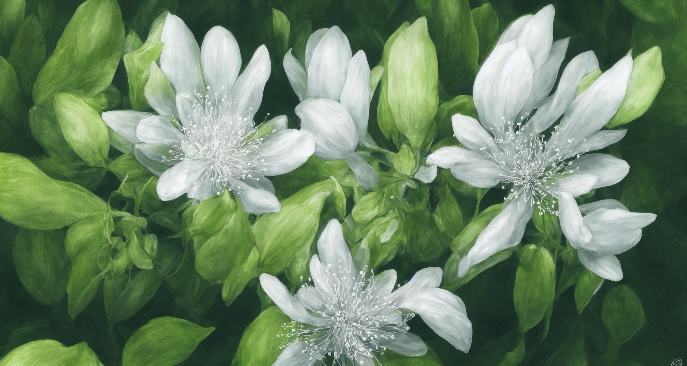

Eine seltene Pflanze, die einem ausgewachsenen Menschen ungefähr bis zur Taile reicht. Sie wächst langsam und nur in Gebieten, die XXXXXXXXXX haben. Sie gilt allgemein als ungemein schön und selten. Durch ihr weit und vor allem tief reichendes Wurzelwerk produziert sie unter bestimmen Umständen Silber in flüssiger Form. Wird der Nektar aus den Blüten entfernt, härter er innerhalb weniger Stunden in reguläres Silber aus. 

Die [Silbri](../Tiere/Silbri.md) ist auf den Nektar angepasst, verzehrt ihn und verteilt die Samen der Pflanze über Adora. 

Dieser [Silbernektar](../../Versorgung/Baumaterialien/Silbernektar.md) ist größte Quelle an Silber in Adora. 

- [ ] Herausfinden wie unter natürlichen Umständen Silber entsteht und das Wachstumsgebiet der Silberblumen daran anpassen. 