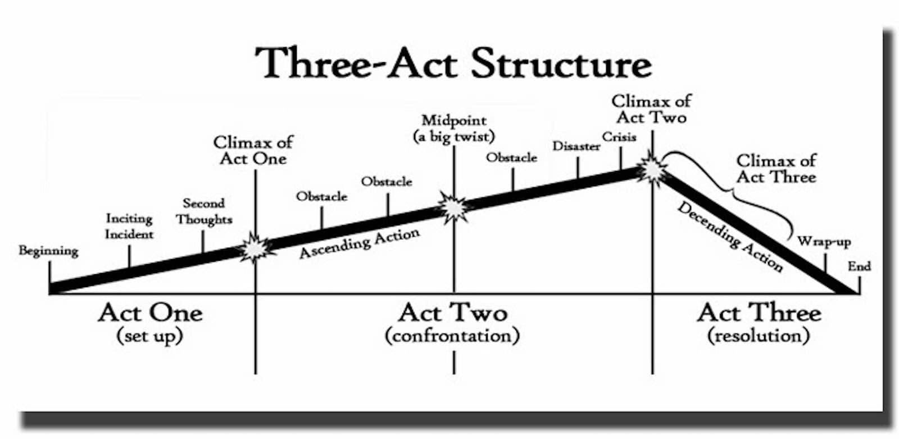

[s.studiobinder.com/wp-content/uploads/2019/08/What-is-The-Three-Act-Structure-Plot-Diagram.jpg?resolution=1680,1.600000023841858](https://s.studiobinder.com/wp-content/uploads/2019/08/What-is-The-Three-Act-Structure-Plot-Diagram.jpg?resolution=1680,1.600000023841858)

# Akt 1 (Set Up)
Der erste Akt bildet die Einleitung der Geschichte und stellt die Protagonisten und Welt vor. In diesem Teil werden die wichtigsten Charaktermerkmale (Stärken, Schwächen) und Hintergründe erläutert. „Want“ und „Need“ werden angedeutet.

## Einführung
Aufhänger, Versprechen des Autors, Ton, Stil und Genre werden etabliert. Der Protagonist wird vorgestellt. 

## Inciting Incident
Auslösendes Ereignis, das den Protagonisten aus den gewohnten Abläufen herausreißt. Es löst den eigentlich Plot aus, aber die eigentliche Handlung fängt noch nicht an. 

## Second Thoughts 
Zweifel an der eingeschlagenen Richtung oder dem bisherigen Leben. 

## Klimax von Akt 1 
Der erste Plotpunkt, der nach etwa ~25% der Länge geschehen sollte. Markiert das Ende des Ersten Akts. An dieser Stelle geschieht etwas Unumkehrbares, das verhindert, dass der Protagonist in sein altes Leben zurückkehrt. Er ist gezwungen sich in die Haupthandlung zu stürzen. Der zentrale Konflikt beginnt. 

# Akt 2 (Steigerung)
Im zweiten Akt spielt sich der Hauptteil der Handlung ab. Hier kommt der zentrale Konflikt zum Tragen.

## Ascending Action / Steigende Handlung
Die Situation verschärft sich. 

## Midpoint/Mittelpunkt
Etwa nach der Hälfte der Handlung ereignet sich der zweite wichtige Plotpunkt, der „Midpoint“. Hier ändert sich der Fokus der Geschichte. In der Regel fällt der Midpoint auch mit einem Einstellungswandel des Protagonisten zusammen. Während der Protagonist in der ersten Hälfte der Geschichte noch damit beschäftigt ist, auf Ereignisse zu reagieren, nimmt er die Sache nach dem Midpoint selbst in die Hand und verfolgt aktiv seine Ziele.

## Weitere Zuspitzung 
Situation verschärft sich weiter. 

## Krise 
Spannung steigt und Protagonist erreicht seinen Tiefpunkt/die aussichtsloseste Situation bisher. Handlungsstränge kommen zusammen, um dem Protagonisten das Leben schwer zu machen. 

## Klimax von Akt 2 / Second Plotpoint
Nach etwa 75 Prozent der Handlung ereignet sich der zweite Plotpunkt, der den Übergang in den dritten Akt einleitet. Die Spannung erreicht den Höhepunkt. Oft geht dies mit einem vorläufigen Scheitern des Protagonisten einher. Der Klimax vom 2. Akt leitet die Auflösung der Konflikte und damit den 3. Akt ein. 

# Akt 3 (Auflösung)
Im dritten Akt löst sich der zentrale Konflikt der Geschichte. Unser Protagonist weiß nun, wie er sein Ziel erreichen kann, was zu tun ist, um den Bösen zu besiegen oder seine Liebste zu erobern. Er hat nun alle Fähigkeiten und Informationen, um frühere Fehler zu korrigieren und zum finalen Schlag auszuholen.

## Abnehmende Spannung 
Handlungsstränge kommen zusammen, um den zentralen Konflikt zu lösen. Der Protagonist greift auf gelernte Lektionen zurück und bewältigt die Herausforderungen der Geschichte. 

## Wrap-Up
Die letzten losen Handlungsfäden werden aufgelöst oder zumindest angesprochen. Möglicherweise erhalten wichtige Nebencharaktere einen abschließenden Auftritt. 

## Ende

